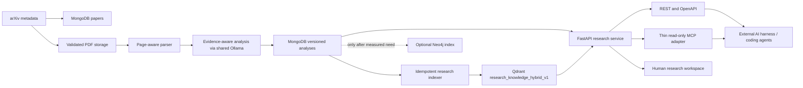
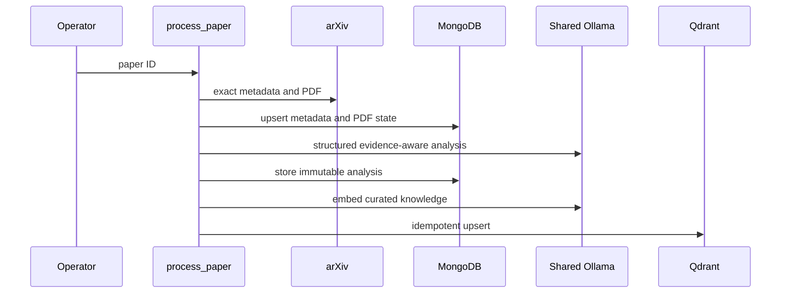
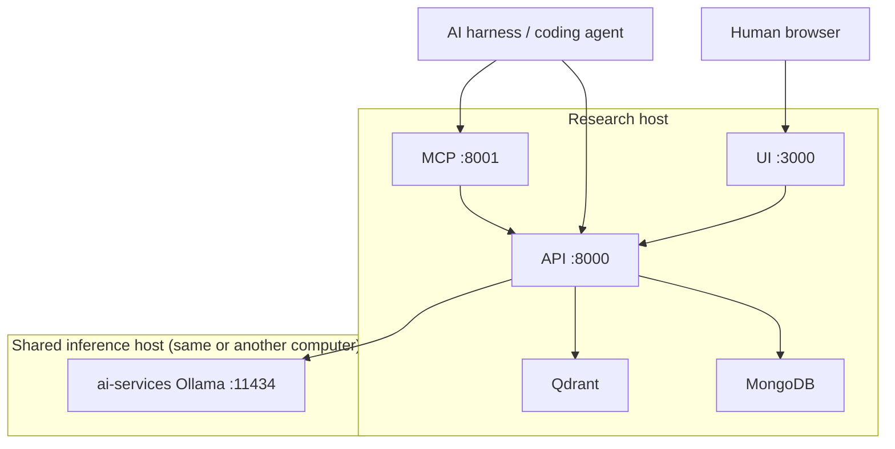

# ArXiv Research Intelligence System Design

## Purpose

The system curates AI papers into structured, evidence-backed knowledge for
coding agents and human review. The canonical product boundary is the research
service, not any individual database or model.

## Active architecture

The minimum always-on stack is:

- MongoDB for paper metadata, document state, and versioned analyses;
- Qdrant for hybrid dense and lexical retrieval;
- FastAPI for the machine-readable service;
- the MCP adapter for agent-native Streamable HTTP/stdio access;
- the React web UI for human discovery and review.

Ollama is owned by the separate `ai-services` project and is shared by this and
other local projects. Analysis and indexing call it over the configured host
and port.

## Storage ownership

| Store | Responsibility | Authority |
| --- | --- | --- |
| MongoDB | Source metadata, PDF state, immutable analyses, prompt/model/schema provenance, and corrections | Canonical |
| PDF storage | Exact validated source documents under portable project-relative paths by default | Canonical source artifact |
| Qdrant | Evidence, claims, findings, limitations, and implementation ideas embedded for search | Rebuildable index |
| Neo4j | A future relationship index if graph retrieval proves useful | Optional experiment |

BERTopic and Top2Vec collections are historical artifacts. They are not used to
build the current Qdrant collection, agent context, catalog, or UI.

## Identity and provenance

- A paper uses a normalized base arXiv ID and retains an exact `vN` version when
  available.
- The stable public resource identifier is `paper://arxiv/<base-id>`.
- An analysis identity includes the paper, PDF hash, schema version, prompt
  version, and model.
- An evidence ID is deterministic over its document/page/chunk/quote source.
- A Qdrant point identity is deterministic, making repeated indexing an upsert
  rather than a duplicate.

These identifiers let an agent cite knowledge without receiving MongoDB `_id`
values or depending on database layout.

## Retrieval path

The active Qdrant collection stores one named dense vector and one named sparse
lexical vector per research point. Search performs:

1. dense candidate retrieval through the shared Ollama embedding model;
2. dependency-free hashed lexical retrieval with Qdrant-managed IDF;
3. weighted reciprocal-rank fusion;
4. a final repeated-paper diversity penalty;
5. provenance-preserving response construction.

Both candidate paths receive the same paper and knowledge-kind filters.
Candidate retrieval has a fixed minimum depth so a request for eight final
results is evaluated over the same useful search space as a larger request.
The API identifies the retrieval mode and RRF score semantics explicitly.

## Processing flows

### Exact paper

Existing valid PDFs, matching analyses, and matching Qdrant point identities
are reused. Force flags are required to intentionally regenerate work.

### Bounded corpus

1. `sync-mongodb` upserts configured arXiv result pages.
2. `download_pdfs` selects a bounded, cross-category corpus and records valid
   files.
3. `process_downloaded_papers` selects a separately bounded analysis batch,
   then analyzes and indexes each paper.

Download count and GPU analysis count are separate configuration controls.
Both commands support dry-run inspection and resumable execution.

## Research service

The public read surface is:

| Operation | Route |
| --- | --- |
| Discover tools and contracts | `GET /research/capabilities` |
| Search curated knowledge | `GET /research/search` |
| List curated papers | `GET /research/papers` |
| Get complete paper context | `GET /research/papers/agent-context` |
| Get token-budgeted agent context | `GET /research/papers/context-package` |
| Get a verified evidence record | `GET /research/evidence/{evidence_id}` |
| Read the machine schema | `GET /openapi.json` |
| Interactive API documentation | `GET /docs` |

An external harness can consume OpenAPI directly or connect to MCP at
`http://<research-host>:8001/mcp`. The MCP process has no MongoDB or Qdrant
credentials. Each tool makes a GET request to one canonical REST operation, so
errors, validation, retrieval, context budgeting, and response schemas still
have one implementation.

MCP exposes the five operation names above. All tools declare read-only,
non-destructive, idempotent annotations. Resources expose
`research://capabilities`, `paper://arxiv/{paper_id}` as the standard context
package, and `evidence://arxiv/{evidence_id}` as an evidence lookup alias.
Streamable HTTP is the LAN transport; stdio is available for a client running
on the research host.

### Agent context selection

The package route keeps the complete context route unchanged and constructs a
deterministic subset of the newest canonical analysis. The `coding-agent-v1`
policy always includes the TLDR, then considers complete implementation ideas,
methods, results, limitations, contributions, problems, concepts, and tags in
that order. Adding an item also adds every evidence record it references. If
the next complete unit does not fit, selection stops; this prefix rule makes
larger budgets monotonic.

The `brief`, `standard`, and `deep` profiles request 1,500, 4,000, and 8,000
estimated tokens. A caller may instead supply a 512-32,768 explicit budget.
`utf8-bytes-div-4-v1` is a deterministic provider-neutral JSON estimate, not a
claim about an exact model tokenizer. The response reports the estimator,
realized size, truncation state, and available/included/omitted counts so a
harness can make an informed final allocation. A budget below the mandatory
TLDR/evidence/provenance core receives 422 and the paper-specific minimum.

## LAN topology

`RESEARCH_API_BIND`, `RESEARCH_MCP_BIND`, and `RESEARCH_UI_BIND` default to
`0.0.0.0`, making the published ports reachable on a trusted LAN. The UI
derives the API host from the browser location, so
`http://<research-host>:3000` automatically calls
`http://<research-host>:8000`. MCP clients connect to
`http://<research-host>:8001/mcp`.

This is a trusted-LAN design, not a public service. Use `127.0.0.1` bindings for
local-only operation. Use a private VPN/Tailscale or add authentication, TLS,
authorization, and rate limiting before crossing the trusted boundary.

## Safety boundaries

- Research discovery endpoints are read-only.
- The MCP container receives only `RESEARCH_API_URL`; it has no database,
  Qdrant, Ollama, mounted data directory, or project-write capability.
- Arbitrary Cypher is disabled unless `ENABLE_LEGACY_CYPHER_API=true`.
- Historical mutation/debug routes are disabled unless
  `ENABLE_LEGACY_MUTATION_API=true`.
- CORS is configured through `CORS_ALLOWED_ORIGINS`.
- Project secrets remain outside version control.

## Optional graph decision gate

The former author-paper-category graph was too shallow to help the active use
case. Neo4j should be expanded only after a retrieval evaluation identifies a
question that needs multi-hop relationships. Any new graph slice must:

1. define the failed agent questions and expected answers;
2. model useful entities such as methods, tasks, benchmarks, claims, citations,
   artifacts, and implementation ideas;
3. add constraints and fixed read queries before ingestion;
4. compare graph-assisted retrieval with the Qdrant baseline;
5. remain optional unless it produces a measurable improvement.

Topic-cluster labels from BERTopic or Top2Vec are not prerequisites for this
graph. Structured concepts/tags from the evidence-aware analysis are more
directly useful and retain paper provenance.

## Deployment profiles

- Default: MongoDB, Qdrant, API, and web UI.
- `manual`: one-shot application commands, Mongo sync, optional Neo4j, Jupyter,
  and historical operations that do not require the legacy ML stack.
- `legacy`: BERTopic, Top2Vec, the historical Qdrant experiment, and their large
  Torch/Transformers runtime.

The core image intentionally excludes the legacy ML stack so API and ingestion
builds remain small and compatible with the current hardware.
