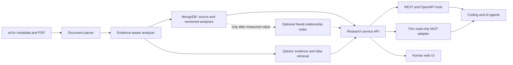

# Agent-First Research Intelligence Plan

## Product decision

Deep Research Pipeline is being refocused from a general paper dashboard into a
local research-intelligence service for AI and coding agents. Humans remain a
first-class client, but the canonical product surface is structured,
machine-readable context with traceable evidence.

The primary job is:

> Turn an AI paper into trustworthy, implementation-oriented knowledge that a
> coding agent can retrieve, cite, compare, and apply to a software project.

This is not a generic autonomous-agent framework. The system owns research
knowledge; external agents use it through stable REST/OpenAPI and MCP tools.

## Product principles

1. **Evidence before eloquence** - important claims must point to a page and
   quote from the source document.
2. **Structured before prose** - summaries are versioned JSON contracts, not
   unstructured blobs.
3. **Agent-readable by default** - responses are compact, deterministic, and
   safe to place in an agent context window.
4. **Local-first and provider-neutral** - the first implementation uses Ollama,
   while the analysis interface permits another local or hosted model later.
5. **Idempotent processing** - document hash, model, prompt, and schema versions
   identify an analysis. A rerun does not silently overwrite prior work.
6. **Separate facts from interpretations** - source evidence, paper claims, and
   implementation ideas are distinct fields.
7. **Progressive enrichment** - a paper is useful after summarization; graph and
   vector enrichment can happen independently afterward.

## Primary use cases

### Coding-agent context

Given a paper ID, return a compact package containing:

- the problem addressed by the paper;
- key methods and contributions;
- reported results and limitations;
- implementation ideas and where they may apply;
- risks, assumptions, and open questions;
- page-level evidence for every material claim;
- stable resource identifiers and analysis provenance.

### Research synthesis

Find and compare techniques across papers, especially ideas relevant to agent
harnesses, workflows, tool use, MCP, memory, evaluation, and coding agents.

### Human review

Allow a person to inspect the same evidence, correct derived knowledge, and
decide what should be passed to a coding agent.

## Target architecture

### Storage responsibilities

| Store | Canonical responsibility |
| --- | --- |
| MongoDB | Raw paper metadata, document-processing state, complete versioned analyses, prompt/model provenance, and corrections |
| Qdrant | Evidence, claims, and implementation ideas with active named dense/sparse vectors and evaluated hybrid retrieval |
| Neo4j | Optional relationship experiment for methods, concepts, claims, tasks, benchmarks, and software ideas, only after a measured vector-search failure |

MongoDB is the source of truth for derived analyses. Qdrant is the current
rebuildable retrieval index. Neo4j is not part of default serving and becomes
an active index only if an evaluation demonstrates additional value.

### Stable identifiers

- Paper resource: `paper://arxiv/<base-arxiv-id>`
- Paper version: the normalized arXiv ID including `vN`, when available
- Evidence: deterministic hash of document, page, chunk, and normalized quote
- Analysis: deterministic key over paper, document hash, schema version, prompt
  version, and model

## Agent contract

The research service is available to LAN clients now through REST and OpenAPI.
The capability document at `GET /research/capabilities` advertises five
read-only tools:

- `search_research`: `GET /research/search`
- `list_curated_papers`: `GET /research/papers`
- `get_paper_context`: `GET /research/papers/agent-context`
- `get_paper_context_package`: `GET /research/papers/context-package`
- `get_evidence`: `GET /research/evidence/{evidence_id}`

`agent-context` returns metadata plus the newest analysis and never exposes
MongoDB implementation fields such as `_id`. The complete machine schema is at
`GET /openapi.json`. `context-package` is the normal harness surface: it
preserves whole claim/evidence units under fixed or explicit budgets and
reports exactly what was included or omitted.

The MCP surface exposes the same five operations and stable `paper://`
identifiers through stdio and Streamable HTTP. It calls only the REST service
and has no database credentials. Later candidates include `compare_methods`
and `find_implementation_ideas`, but only after their underlying retrieval
contracts are evaluated. MCP remains a thin adapter rather than a second
business-logic implementation.

## Phased plan

### Phase 1 - trustworthy single-paper analysis (completed)

- Normalize arXiv identities.
- Parse PDFs with retained page boundaries.
- Use a hierarchical analysis flow against the shared `ai-services` Ollama
  server so projects do not compete with separate model processes or caches.
- Start with Qwen 3.5 4B as the local analysis default because it is a compact,
  current model with future figure-analysis support. Request a 12K context so
  the model, context cache, and structured output fit comfortably on the
  current 8 GB GPU. Keep the model configurable and evaluate it against the 2B
  fallback and larger alternatives.
- Reject model-produced evidence quotes that cannot be found on the cited page.
- Save versioned structured analyses in MongoDB.
- Provide a manual summarization command and read-only agent-context API.
- Add focused tests for identity, evidence validation, persistence behavior, and
  existing storage regressions.

**Exit condition:** a local PDF can produce a stored, page-cited analysis that an
external agent can fetch as JSON.

Validated on OpenForgeRL (`2607.21557v1`) with Qwen 3.5 4B: the v5 analysis
contains 47 source-verified evidence quotes, is current in MongoDB, and is
available through the agent-context API.

### Phase 2 - retrieval foundation (completed for the current corpus)

- [x] Add a separate versioned, idempotent Qdrant research collection.
- [x] Index page-aware evidence, claims, and implementation ideas.
- [x] Preserve document, page, analysis, prompt, model, and embedding provenance
  in search results.
- [x] Add `GET /research/search` with paper and knowledge-kind filters.
- [x] Establish `mxbai-embed-large:latest` as the 1,024-dimension dense baseline
  through shared Ollama.
- [x] Build a representative coding-agent retrieval evaluation set.
- [x] Compare the baseline with Qwen3-Embedding-0.6B, EmbeddingGemma, and Nomic
  Embed Text v1.5 before selecting the long-term dense model.
- [x] Retain `mxbai-embed-large:latest` as the production dense model; keep
  Nomic Embed Text v1.5 as the measured small/fast fallback.
- [x] Test hybrid dense/sparse retrieval, result diversity, and reranking
  against the measured cross-paper failures.
- [x] Promote the strategy only after it reaches complete grouped recall at the
  API's default top-eight limit without regressing positive-query recall.
- [x] Automate bounded, resumable analysis and indexing after bulk
  metadata/PDF ingestion.

**Exit condition:** representative agent questions retrieve the correct cited
passages and ideas reliably.

### Phase 3 - useful graph (conditional)

- [x] Remove Neo4j from the default service/API dependency path.
- [x] Disable arbitrary client-supplied Cypher by default.
- [x] Identify evaluated cross-paper questions where dense retrieval misses a
  required paper or evidence group.
- [x] Re-evaluate those questions after hybrid retrieval; both are recovered,
  so they do not justify graph infrastructure.
- [ ] Identify a remaining reviewed question with graph-shaped relationships
  that the promoted hybrid path misses.
- [ ] If such a question exists, add constraints and fixed read queries before
  ingesting graph data.
- [ ] Extract only the required methods, tasks, benchmarks, artifacts, claims,
  and citations, then compare graph-assisted retrieval against the baseline.

**Exit condition:** the graph improves a measured research question that vector
retrieval alone misses. If it does not, Neo4j stays optional.

### Phase 4 - MCP and coding-agent workflows

- [x] Publish a stable read-only REST/OpenAPI service on the trusted LAN.
- [x] Add capability discovery, curated catalog, search, paper context, and
  evidence lookup contracts.
- [x] Add deterministic token-budgeted context packages with evidence closure
  and a five-paper corpus evaluation.
- [x] Define the external MCP handoff boundary. Private project-context
  extraction and matching are owned by the separate AI harness project, not
  this research service.
- [x] Add a read-only MCP adapter over the research service with protocol and
  live LAN validation.
- [ ] Support feedback records when an agent applies, rejects, or modifies an
  idea.
- [ ] Add explicit human approval before any tool can write to a software
  project.

### Phase 5 - operations and UI

- [x] Rework the UI around research search, source evidence, paper context, and
  agent tool discovery.
- [x] Resolve the API from the browser hostname for cross-computer LAN use.
- [ ] Add paper comparisons and agent-use history.
- [ ] Add analysis and retrieval quality dashboards.
- [ ] Add queued/background processing when actual throughput requires it.
- [ ] Replace the aging Create React App build stack with Vite/current frontend
  dependencies.

## Deferred work

The following are deliberately not on the critical path:

- Kafka and Zookeeper for a single-machine workflow;
- a generic autonomous-agent manager;
- BERTopic and Top2Vec topic pipelines, which are now explicitly retired from
  the active architecture and retained only in the `legacy` profile;
- further dashboard work that is not tied to research quality or agent use;
- fine-tuning before prompt, retrieval, and evaluation baselines exist;
- importing old databases.

## Completed implementation slices

The first two slices create these components:

1. `src.analysis` schemas, identity normalization, PDF parsing, evidence
   validation, Ollama model adapter, and MongoDB repository.
2. `python -m src.pipeline.summarize_paper` for explicit, inspectable runs.
3. Read endpoints under `/research/papers`.
4. An additive `analysis` configuration block.
5. `src.retrieval` contracts, shared-Ollama embeddings, stable point identity,
   and idempotent Qdrant indexing.
6. `python -m src.pipeline.index_research` and `GET /research/search`.
7. A live retrieval baseline with 75 OpenForgeRL points and representative
   agent-style semantic queries.
8. A bounded bulk workflow for configured Mongo import, validated portable PDF
   storage, and cross-category agent analysis/indexing.
9. A LAN-accessible REST/OpenAPI contract with capability discovery, a curated
   paper catalog, stable evidence lookup, and guarded legacy mutation/debug
   routes.
10. A human research workspace for semantic search, filters, ranked
    evidence-aware results, complete paper context, and provenance.
11. A slim core runtime with BERTopic, Top2Vec, Torch, Transformers, notebooks,
    and historical evaluation tools isolated in a separate legacy image.
12. A five-paper, 38-case retrieval suite with immutable-document validation,
    grouped cross-paper relevance, negative controls, and reproducible
    four-model embedding benchmarks.
13. An evaluated hybrid Qdrant collection with hashed lexical IDF retrieval,
    weighted RRF, stable candidate depth, diversity reranking, and explicit API
    score semantics.
14. Token-budgeted 1.5K/4K/8K agent context packages with 15/15 passing corpus
    evaluations for budget, evidence closure, determinism, provenance, TLDR
    retention, and monotonic selection.
15. A five-tool read-only MCP adapter with stable resources, stdio and
    Streamable HTTP transports, no database credentials, and an end-to-end
    protocol validator.

The first live bulk validation processed 6,000 metadata results with zero
storage failures, selected 600 distinct PDFs across `cs.AI`, `cs.CV`, and
`cs.LG`, and stored 599 valid selected PDFs (one exact arXiv version returned
404). Three cross-category papers produced 119 verified evidence records and
173 stable Qdrant points. Domain queries ranked each corresponding paper first,
and a complete rerun reported metadata reused, PDFs unchanged, analyses
unchanged, and indexes unchanged.

## Next implementation slice

1. Expand the reviewed suite with representative research questions as the
   corpus grows; external harness teams may contribute anonymized cases.
2. Add generic comparison tools only after their expected answers and quality
   measures are defined. Keep private project-context matching in the external
   harness.
3. Migrate the web build from Create React App to Vite and update frontend
   dependencies without changing the research workflow.
