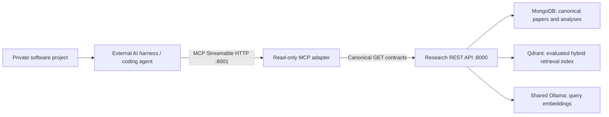

# External AI Harness MCP Integration Handoff

## Purpose

This document is for the coding agent working on the separate AI harness
project. The research system is already responsible for ingesting AI papers,
creating evidence-backed analyses, indexing their useful ideas, and serving the
curated results. The harness should consume that knowledge as an external,
read-only service.

The integration goal is:

> Let a coding agent search for research relevant to its current task, obtain a
> bounded context package for a promising paper, and retain source evidence and
> provenance when it applies an idea.

Project-context extraction and matching belong to the external harness. This
repository does not inspect the harness workspace, receive source trees, or
modify other projects.

## Current network endpoint

The research computer currently reports:

| Setting | Value |
| --- | --- |
| Hostname | `RAZOR-001` |
| LAN IPv4 | `10.0.0.177` |
| Subnet | `10.0.0.0/24` |
| MCP URL | `http://10.0.0.177:8001/mcp` |
| Transport | MCP Streamable HTTP |
| Authentication | None; trusted LAN only |

`10.0.0.177` may change if it is assigned by DHCP. Prefer a DHCP reservation,
or use `http://RAZOR-001:8001/mcp` if that hostname resolves from the harness
computer. Do not expose this unauthenticated endpoint to the public Internet.

The server has been validated through its LAN-bound address from the research
computer. The final network/firewall check must be run from the separate
harness computer.

## Architecture and ownership boundary



The important boundary is the MCP adapter:

- It contains no research business logic; it maps MCP calls to the canonical
  read-only REST contracts.
- It has no MongoDB, Qdrant, Ollama, PDF-storage, or software-workspace
  credentials.
- It cannot ingest papers, rebuild indexes, write feedback, or change a
  software project.
- MongoDB remains the source of truth. Qdrant is a rebuildable retrieval index.
- Search uses the evaluated dense-plus-lexical hybrid strategy and returns
  evidence and analysis provenance with each hit.
- Neo4j, BERTopic, and Top2Vec are not part of this integration.

The external harness owns:

- extracting a concise description of the current coding problem;
- deciding when research lookup is useful;
- sending an appropriate natural-language query;
- ranking or combining research with local project knowledge;
- deciding whether and how to apply an idea;
- keeping private source code local unless the user explicitly chooses to
  include selected details in a query.

## MCP client configuration

Configure a network MCP server in the harness:

```json
{
  "mcpServers": {
    "arxiv-research": {
      "type": "http",
      "url": "http://10.0.0.177:8001/mcp"
    }
  }
}
```

Some harnesses name the transport field `transport` or use the value
`streamable-http` instead of `type: "http"`. Adapt only those client-specific
field names. The invariant endpoint is:

```text
http://10.0.0.177:8001/mcp
```

This is Streamable HTTP, not the legacy MCP SSE transport. The other project
does not need to clone this repository and must not be given database
credentials.

## Available tools

All five tools advertise `readOnlyHint=true`, `destructiveHint=false`,
`idempotentHint=true`, and `openWorldHint=false`.

| Tool | Use | Important inputs |
| --- | --- | --- |
| `search_research` | Search cited claims, evidence, and implementation ideas across curated papers | `query`; optional `limit` 1-50, `paper_id`, `kind`, and normalized `min_relevance` 0-1 |
| `list_curated_papers` | Discover which papers have a current curated analysis | optional `offset` and `limit` |
| `get_paper_context_package` | Get normal agent context under a deterministic token budget | `paper_id`; `profile` or optional `token_budget` |
| `get_paper_context` | Get the complete canonical analysis when a bounded package is insufficient | `paper_id` |
| `get_evidence` | Resolve an evidence ID to an exact quote, source page, and provenance | `evidence_id` |

Valid search `kind` filters are:

```text
evidence
claim
implementation_idea
```

Context profiles are:

| Profile | Target estimated JSON tokens | Recommended use |
| --- | ---: | --- |
| `brief` | 1,500 | Triage several candidate papers |
| `standard` | 4,000 | Normal implementation or design work |
| `deep` | 8,000 | Detailed review after a paper is selected |

An explicit `token_budget` from 512 through 32,768 overrides the profile size.
The estimate is provider-neutral, so the harness may apply its own tokenizer
before inserting the package into a model context.

Context packages are evidence-closed: an included claim or implementation idea
retains all evidence records required to support it. Each response also reports
what was included, omitted, or truncated.

Search defaults to `min_relevance=0.05`. A below-threshold query returns
`result_status="no_match"`, `hits=[]`, and `no_match_reason`; this is a normal
successful result. Set `min_relevance=0` only for diagnostics. Each hit keeps
the raw RRF `score` and adds normalized `relevance`. Read
`score_calibration`: relevance measures dense/lexical retriever agreement, not
topical probability. `coverage` reports the indexed and filter-eligible paper
and point counts.

Implementation-idea hits use one canonical `text` and expose structured fields
under `implementation_idea`. Evidence records expose a complete sentence-aware
`quote`, the exact matched `supporting_quote`, and `truncated`; normal search
and context packages do not return truncated evidence.

## Recommended agent workflow

1. Convert the local task into a research question without sending unnecessary
   private code. Include the failure mode, constraint, or desired behavior.
2. Call `search_research` with the evaluated default `limit=8`.
3. Stop successfully when `result_status="no_match"`. Otherwise review
   `relevance`, distinct papers, result `kind`, source pages, and evidence IDs.
   Search results are curated corpus matches, not a claim of complete or
   up-to-the-minute literature coverage.
4. Call `get_paper_context_package` with `profile="brief"` for triage or
   `profile="standard"` for the selected paper.
5. Call `get_evidence` before making a source-sensitive claim or preserving a
   citation in a design document.
6. Keep `paper_id`, `paper_version_id`, `evidence_id`, source page,
   `document_hash`, `prompt_version`, and analysis model with any idea carried
   into the local project.
7. Use `get_paper_context` only when the bounded package demonstrably omits
   necessary detail.

Suggested instructions for the harness agent:

```text
The arxiv-research MCP server is a read-only curated AI-paper knowledge
service. Use search_research when research could improve a design,
implementation, agent workflow, evaluation, or debugging approach. Search
before choosing a paper, then use get_paper_context_package for bounded
context. Resolve evidence IDs before presenting source-sensitive claims.
Distinguish a paper's reported result from your own proposed adaptation.
Preserve paper IDs, evidence IDs, pages, and provenance. Never imply that the
curated corpus is a complete search of current literature. None of these tools
can modify the local project or the research service.
```

## Cross-computer connectivity test

From PowerShell on the harness computer:

```powershell
Test-NetConnection 10.0.0.177 -Port 8001
```

The required result is:

```text
TcpTestSucceeded : True
```

From Linux or macOS:

```bash
nc -vz 10.0.0.177 8001
```

If the port is unreachable:

1. Confirm both computers are on the trusted `10.0.0.0/24` LAN.
2. Confirm that the research computer still has `10.0.0.177`.
3. Ask the research-system owner to confirm the `api` and `mcp` containers are
   running.
4. Check the Windows Private-network firewall on `RAZOR-001`.

If a firewall rule is required, the research-system owner can run this once
from an elevated PowerShell prompt:

```powershell
New-NetFirewallRule `
  -DisplayName "ArXiv Research MCP (Private LAN)" `
  -Direction Inbound `
  -Action Allow `
  -Protocol TCP `
  -LocalPort 8001 `
  -RemoteAddress 10.0.0.0/24 `
  -Profile Private
```

Do not create a public-profile or Internet-wide rule.

## Standalone end-to-end test

The following test is independent of the harness and proves MCP
initialization, exact tool discovery, read-only annotations, hybrid search,
structured JSON output, and evidence resolution.

The harness should use its own current MCP client; it does not need to match
the Python SDK version used internally by the research server. The optional
standalone test below uses the modern Python SDK v2 client API. On July 27,
2026, v2 is still a release candidate, so opt in explicitly in a temporary
environment:

```powershell
python -m pip install --pre --upgrade "mcp>=2.0.0rc1,<3"
python -c "import importlib.metadata; print(importlib.metadata.version('mcp'))"
```

No `streamable_http_client` or `streamablehttp_client` transport import is
needed with the v2 high-level `Client`; it accepts the remote MCP URL directly.

Save this as `test_research_mcp.py` in the external project:

```python
import asyncio
import json
import os

from mcp import Client

URL = os.getenv(
    "RESEARCH_MCP_URL",
    "http://10.0.0.177:8001/mcp",
)
EXPECTED_TOOLS = {
    "search_research",
    "list_curated_papers",
    "get_paper_context",
    "get_paper_context_package",
    "get_evidence",
}


async def call_json(client, name, arguments):
    result = await client.call_tool(name, arguments)
    if result.is_error:
        message = result.content[0].text if result.content else "unknown MCP error"
        raise RuntimeError(f"{name} failed: {message}")
    if not isinstance(result.structured_content, dict):
        raise RuntimeError(f"{name} did not return structured JSON")
    return result.structured_content


async def main():
    async with Client(URL) as client:
        listed = await client.list_tools()
        tools = {tool.name: tool for tool in listed.tools}

        assert set(tools) == EXPECTED_TOOLS
        assert all(
            tool.annotations is not None
            and tool.annotations.read_only_hint is True
            and tool.annotations.destructive_hint is False
            for tool in tools.values()
        )

        search = await call_json(
            client,
            "search_research",
            {
                "query": "How does the harness record RL training data?",
                "limit": 3,
            },
        )
        assert search["contract"] == "research-search-results"
        assert search["hits"]
        top = search["hits"][0]

        evidence = await call_json(
            client,
            "get_evidence",
            {"evidence_id": top["evidence_ids"][0]},
        )
        resolved = evidence["evidence"]

        print(
            json.dumps(
                {
                    "server": client.server_info.name,
                    "protocol_version": client.protocol_version,
                    "tool_count": len(tools),
                    "search_contract": search["contract"],
                    "result_status": search["result_status"],
                    "retrieval_mode": search["retrieval_mode"],
                    "corpus_papers": search["coverage"]["papers"],
                    "top_title": top["title"],
                    "top_paper_id": top["paper_id"],
                    "top_kind": top["kind"],
                    "top_score": top["score"],
                    "top_relevance": top["relevance"],
                    "top_text": top["text"],
                    "evidence_id": resolved["evidence_id"],
                    "evidence_page": resolved["page"],
                    "evidence_quote": resolved["quote"],
                },
                indent=2,
            )
        )


asyncio.run(main())
```

Run it:

```powershell
$env:RESEARCH_MCP_URL = "http://10.0.0.177:8001/mcp"
python .\test_research_mcp.py
```

The same test can be run without changing the external project's dependency
files when `uv` is available:

```powershell
uv run --isolated --no-project --prerelease=allow `
  --with "mcp>=2.0.0rc1,<3" `
  python .\test_research_mcp.py
```

## Observed example response

On July 28, 2026, the standalone test above returned:

```json
{
  "server": "arxiv_research_mcp",
  "protocol_version": "2025-11-25",
  "tool_count": 5,
  "search_contract": "research-search-results",
  "result_status": "matches",
  "retrieval_mode": "hybrid",
  "corpus_papers": 53,
  "top_title": "OpenForgeRL: Train Harness-native Agents in Any Environment",
  "top_paper_id": "2607.21557",
  "top_kind": "claim",
  "top_score": 0.03240343,
  "top_relevance": 0.87660923,
  "top_text": "The system uses a lightweight proxy to record prompt-response pairs from harness inference, converting them into standard samples compatible with RL codebases like veRL.",
  "evidence_id": "ev_5002c8b64d726803e47397a1",
  "evidence_page": 1,
  "evidence_quote": "To address this, we present OPENFORGE RL, an open-source framework for training harness-based agents end-to-end in diverse environments. OPENFORGE RL achieves this with a lightweight proxy that serves the harness’s model calls while recording them as training data for a standard RL codebase (e.g., veRL), and a Kubernetes orchestrator that runs each rollout in its own remote container, together enabling training on any harness in any environment at scale. By decoupling training and inference, OPENFORGE RL allows researchers to easily train, study, and improve agents directly in the real harnesses and environments they are deployed with."
}
```

The quote above illustrates the repaired evidence contract: a readable
sentence is returned while the exact source substring remains available as
`supporting_quote`. Exact rank scores may change after an intentional corpus
or index rebuild.
Contracts, stable IDs, evidence records, and required provenance are the
integration surface.

## Integration acceptance checklist

- [ ] The harness computer can open TCP port 8001 on `RAZOR-001`.
- [ ] MCP initialization succeeds over Streamable HTTP.
- [ ] Tool discovery returns exactly the five documented tools.
- [ ] Every tool is marked read-only and non-destructive.
- [ ] The example search returns at least one structured hit.
- [ ] An unrelated query returns `result_status=no_match` and no hits at the
      default threshold.
- [ ] Search output includes normalized relevance and corpus coverage.
- [ ] `get_evidence` resolves a returned evidence ID.
- [ ] Resolved evidence is not truncated and ends at a sentence boundary.
- [ ] The harness uses budgeted context for normal work.
- [ ] The harness retains paper/evidence provenance in generated
      recommendations.
- [ ] No database, Ollama, PDF-storage, or research-host filesystem access was
      added to the external project.
- [ ] The MCP endpoint is not exposed outside the trusted LAN.

## Failure semantics

- Connection refused or timeout before initialization normally means the
  service is down, the host address changed, or a firewall blocks port 8001.
- A tool error preserves the canonical REST status/detail. Treat validation
  errors as non-retryable until the input is corrected.
- A context request below the mandatory evidence/provenance core returns an
  error identifying the minimum viable budget; retry with that larger budget.
- Search can legitimately return no hits when the curated corpus has no
  relevant material. Do not invent a research answer.
- Because the tools are GET-only and idempotent, transient transport failures
  can be retried with normal bounded backoff.

## Research-system owner commands

These are provided for diagnosis; the external harness should not run them.
From this repository on `RAZOR-001`:

```powershell
docker compose up -d mongodb qdrant api mcp
docker compose ps api mcp

.\.venv\Scripts\python.exe -m src.pipeline.validate_mcp `
  --url http://10.0.0.177:8001/mcp `
  --paper-id 2607.02134
```

The current owner-side validation passes all tool, annotation, context,
evidence, and resource checks.
