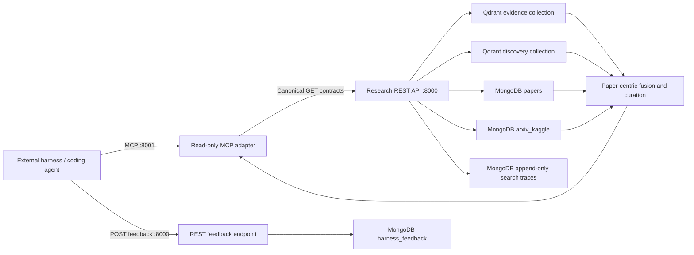

# External AI Harness MCP Integration Handoff

## Purpose

This document is the current integration contract for the coding agent on the
separate AI harness computer. The research service exposes one read-only search
workflow. A client does not choose a database or Qdrant collection.

The integration goal is:

> Send one bounded research question and receive a deduplicated, paper-centric
> result assembled from every relevant research source, with verified evidence
> kept clearly separate from metadata-only discovery leads.

Project-context extraction and final engineering judgment remain the external
harness's responsibility. This service does not inspect or modify the harness
workspace.

## Network endpoint

| Setting | Value |
| --- | --- |
| Research host | `RAZOR-001` |
| Current LAN IPv4 | `10.0.0.177` |
| MCP URL | `http://10.0.0.177:8001/mcp` |
| Transport | MCP Streamable HTTP |
| Authentication | None; trusted LAN only |

Prefer a DHCP reservation or
`http://RAZOR-001:8001/mcp` when that hostname resolves from the harness
computer. Do not expose this unauthenticated endpoint to the public Internet.

Example client configuration:

```json
{
  "mcpServers": {
    "arxiv-research": {
      "type": "http",
      "url": "http://10.0.0.177:8001/mcp"
    }
  }
}
```

This endpoint uses Streamable HTTP, not legacy MCP SSE.

## Current architecture



The two Qdrant collections are complementary sources, not old and new API
versions:

- `research_knowledge_hybrid_v1` contains PDF-derived evidence, claims,
  limitations, and implementation ideas from current paper analyses.
- `arxiv_discovery_current` is the stable alias for title/abstract discovery
  over eligible Kaggle papers.

The strings in their physical names do not represent client-visible API
generations. Both collections participate in the same `search_research` call.
Corpus counts are intentionally not part of the client contract: block indexing
can increase them over time.

MongoDB remains the canonical metadata and analysis store. Qdrant is a
rebuildable retrieval layer. Neo4j, BERTopic, Top2Vec, and the retired
`arxiv_papers` Qdrant collection are not part of this serving path.

Feedback is the one write operation exposed to the external harness. It
bypasses MCP and uses `POST /research/feedback` on REST port 8000. It writes
only append-only evaluation events to `harness_feedback`; it cannot modify
papers, analyses, indexes, search history, or any read response. The complete
batch and taxonomy contract is in
[External AI Harness Feedback Endpoint Specification](16-harness_feedback_endpoint_spec.md).

## Canonical search workflow

`search_research` performs the complete request workflow:

1. Embeds the query once when both collections use the same embedding model.
2. Searches the evidence and discovery collections concurrently.
3. Overfetches candidates so point-level duplication does not consume the
   requested paper limit.
4. Normalizes every result to a versionless arXiv ID.
5. Aggregates multiple evidence points under one paper.
6. Hydrates candidates from both MongoDB `papers` and `arxiv_kaggle`.
7. Merges richer Kaggle fields into evidence-backed papers instead of
   discarding the duplicate.
8. Applies relevance-aware weighted reciprocal-rank fusion at paper level.
9. Returns at most the requested number of unique papers under the requested
   estimated-token budget.
10. Reports each source's status and can return partial results if one Qdrant
    collection is temporarily unavailable.
11. Stores the request, both pre-fusion source pulls, and the exact curated
    response under the returned `request_id`.

The service never presents an abstract as verified source evidence.

## MCP tools

The MCP server exposes exactly five tools. All are read-only for research data,
non-destructive, and closed-world. `search_research` is not marked idempotent
because every invocation creates a new append-only evaluation trace and
returns a new `request_id`; the other four tools are idempotent.

| Tool | Use |
| --- | --- |
| `search_research` | Canonical search across both complementary Qdrant collections and both MongoDB metadata sources |
| `list_curated_papers` | List papers with a current evidence-backed analysis |
| `get_paper_context_package` | Get deterministic evidence-closed context under a token budget |
| `get_paper_context` | Get the complete canonical analysis for one evidence-backed paper |
| `get_evidence` | Resolve a verified evidence ID to its quote, page, and provenance |

There are no separate discovery, federated, or legacy search tools.

### `search_research` inputs

| Input | Default | Meaning |
| --- | ---: | --- |
| `query` | required | Natural-language implementation or research question |
| `limit` | `8` | Maximum unique papers, from 1 through 50 |
| `paper_id` | omitted | Optional arXiv ID or URL restriction |
| `kind` | omitted | Optional `evidence`, `claim`, or `implementation_idea` filters |
| `category` | omitted | Optional exact arXiv category filters |
| `start_year` / `end_year` | omitted | Optional inclusive metadata year window |
| `min_relevance` | service default | Per-source normalized relevance threshold |
| `evidence_per_paper` | `3` | Maximum curated research items retained per paper |
| `token_budget` | `12000` | Estimated JSON-token budget, from 2,000 through 32,768 |

The token estimator is provider-neutral UTF-8 bytes divided by four. A harness
may perform an exact final count for its own model.

## Search response contract

Successful search returns `contract="curated-research-results"` and one
`papers` array. Each paper appears at most once.

Important fields:

```json
{
  "contract": "curated-research-results",
  "request_id": "rs_6b81712a73ad4dd1a9c42e1a1ca95039",
  "generated_at": "2026-07-30T18:42:10.123456Z",
  "query": "research question",
  "result_status": "matches",
  "ranking": "weighted-paper-rrf",
  "coverage": {
    "partial": false,
    "sources": [
      {
        "source": "evidence",
        "collection": "research_knowledge_hybrid_v1",
        "status": "matches"
      },
      {
        "source": "discovery",
        "collection": "arxiv_discovery_current",
        "status": "matches"
      }
    ],
    "unique_candidate_papers": 18,
    "returned_papers": 8
  },
  "budget": {
    "requested_tokens": 12000,
    "estimated_tokens": 7124,
    "requested_papers": 8,
    "returned_papers": 8,
    "omitted_papers": 10,
    "truncated": true
  },
  "papers": [
    {
      "rank": 1,
      "paper_id": "2607.02134",
      "tier": "evidence_backed",
      "metadata": {
        "title": "Coding-agents can replicate scientific machine learning papers",
        "abstract": "...",
        "authors": ["Atharva Hans", "Ilias Bilionis"],
        "categories": ["cs.AI"],
        "metadata_sources": ["papers", "arxiv_kaggle"]
      },
      "source_scores": [
        {"source": "evidence", "rank": 1},
        {"source": "discovery", "rank": 1}
      ],
      "research_items": [
        {
          "kind": "claim",
          "text": "...",
          "pages": [2],
          "evidence_ids": ["ev_..."],
          "evidence": [{"evidence_id": "ev_...", "page": 2, "quote": "..."}]
        }
      ]
    }
  ]
}
```

The example identifiers and counts are illustrative, not fixed expectations.
Retain the `request_id` in the harness run/report so a judgment can be
cross-read against the exact stored search output. Feedback contract v1 does
not require this field, but the endpoint preserves it as an extension when a
sender includes it.

### Trust tiers

- `tier="evidence_backed"` means `research_items` contains source-grounded
  material. Each item retains evidence IDs, quotes, pages, document hash,
  analysis model, prompt, and embedding provenance.
- `tier="metadata_only"` is a discovery lead based on title and abstract.
  `research_items` is empty. The coding agent may use it to identify a paper,
  but must not present its abstract as verified evidence.

When the same paper is returned by both Qdrant collections, it remains one
`evidence_backed` paper and receives the metadata available from both MongoDB
collections.

`coverage.partial=true` means one retrieval source was unavailable and the
response contains the useful results from the other. An HTTP 503 is returned
only when neither retrieval source can serve the request.

## Paper context tools

Context profiles remain:

| Profile | Target estimated JSON tokens | Recommended use |
| --- | ---: | --- |
| `brief` | 1,500 | Fast orientation |
| `standard` | 4,000 | Normal implementation or design work |
| `deep` | 8,000 | Detailed review |

An explicit `token_budget` from 512 through 32,768 overrides the profile.
Context packages are evidence-closed: every included claim or implementation
idea retains all evidence records needed to support it.

`get_paper_context_package` and `get_paper_context` apply to
`evidence_backed` papers. A metadata-only lead may not have a current PDF
analysis yet.

## Recommended coding-agent behavior

1. Convert the local engineering task into a concise research question without
   sending unnecessary private source code.
2. Call `search_research` with the default unique-paper limit and token budget.
3. Inspect rank, tier, source scores, metadata, and source coverage.
4. Use metadata-only papers as leads. Do not cite their abstracts as verified
   findings.
5. For a promising evidence-backed paper, call
   `get_paper_context_package(profile="standard")`.
6. Resolve important evidence IDs with `get_evidence` before making
   source-sensitive claims.
7. Preserve the request ID, paper IDs, point IDs, evidence IDs, pages, document
   hash, prompt version, and analysis model with recommendations carried into
   the local project.
8. Stop successfully when `result_status="no_match"`; do not invent a research
   answer.

Suggested harness instruction:

```text
The arxiv-research MCP server provides one read-only search across
complementary evidence and discovery collections. Always begin with
search_research. Each returned paper is unique. Treat evidence_backed research
items as source-grounded and metadata_only papers as discovery leads. Use a
budgeted paper context for deeper work and resolve evidence IDs before making
source-sensitive claims. Preserve paper and evidence provenance. Never imply
that a metadata abstract is verified evidence or that the indexed corpus is a
complete survey of current literature.
```

## Connectivity and validation

From the harness computer:

```powershell
Test-NetConnection 10.0.0.177 -Port 8001
```

Owner-side live validation:

```powershell
python -m src.pipeline.validate_mcp `
  --url http://localhost:8001/mcp `
  --paper-id 2607.02134
```

The validation must report:

- exactly five tools;
- all tools read-only and non-destructive;
- a valid `curated-research-results` search contract;
- a stable request ID and generation timestamp for feedback correlation;
- unique paper IDs, both complementary source roles, full source coverage, and
  search output within the requested token budget;
- standard context and evidence contracts valid;
- fixed and templated MCP resources readable;
- `all_passed=true`.

The canonical search evaluation is:

```powershell
python -m src.pipeline.evaluate_curated_search `
  --output data/evaluations/curated_research.json
```

The evaluated cases check positive evidence-backed searches, metadata
discovery, negative year filtering, unique paper IDs, token-budget compliance,
trust-tier invariants, and reporting from both sources.

## Failure semantics

- Connection refusal before initialization means the MCP service is down,
  unreachable, or blocked by the firewall.
- A validation error is non-retryable until the input is corrected.
- `result_status="no_match"` is a successful empty search.
- `coverage.partial=true` is a successful degraded search from one source.
- HTTP 503 means neither retrieval source could complete the search.
- A context request below its evidence/provenance core returns the required
  minimum budget.
- All tools are GET-backed and safe to retry with bounded backoff. Retrying
  `search_research` creates a separate trace and request ID; feedback must
  reference the response the coding agent actually evaluated.

## Security boundary

The MCP adapter has no direct database, Qdrant, Ollama, PDF-storage, or
software-workspace credentials. It calls only the canonical REST API. The API
stores append-only search traces in MongoDB; it does not mutate the paper
corpus, analyses, or indexes during search. Because the query text and exact
delivered output are retained, clients should not send unnecessary private
source code. The endpoint is intended for the trusted private LAN and must not
be publicly forwarded without authentication, TLS, authorization, rate
limiting, and an allowed-host policy.

The trace collections and feedback-correlation contract are documented in
[Research search history and feedback readiness](17-search_history_feedback_readiness.md).
The isolated REST write contract is documented in
[External AI Harness Feedback Endpoint Specification](16-harness_feedback_endpoint_spec.md).
