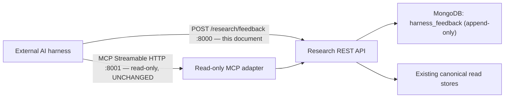

# External AI Harness Feedback Endpoint Specification

## Purpose

This document is for the coding agent working on **this research system
repository**. It is the mirror of
[15-external_ai_harness_mcp_handoff.md](./15-external_ai_harness_mcp_handoff.md):
that document defined what the external AI harness may *read*; this one defines
the single thing it may *write*.

The external harness runs a `research-scan` workflow that consumes this
service's curated corpus (survey → curate → triage → propose → appraise). Every
scan already produces structured judgments about what this service supplied:
papers screened out at triage with a named cause, proposed ideas independently
appraised ADOPT / TRIAL / REJECT with reasons, citations that failed to
resolve, and topics the corpus turned out to hold nothing on. Today those
judgments die in the harness's report files. This endpoint captures them.

The integration goal is:

> Let the harness return one structured feedback record per judgment it already
> makes — with a reason code that says *which subsystem the signal is about* —
> so the research-system owner can adjust the curation workflow that ingests
> and analyzes material from its three upstream sources, based on how the
> output actually performed in a consuming project.

"Not useful" is not a signal anyone can act on. `off_topic` (retrieval
surfaced a different field), `evidence_truncated` (chunking cut a sentence),
and `not_project_fit` (good paper, wrong project) are three different facts
that route to three different places — the third being *no defect at all*.
The reason registry below exists to preserve those distinctions.

### Non-goals (v1)

- **Not model-training data.** The store does not preclude later use as an
  evaluation or training set, but v1's purpose is operational: tune the
  curation workflow. Do not build training-pipeline machinery against it.
- **No per-project result shaping.** Feedback must not change what search or
  context returns to any project (see Hard rules).
- **No automatic curation changes.** v1 accumulates and reports; the owner
  reviews and adjusts the workflow deliberately.

## Architecture and ownership boundary

Feedback **bypasses the MCP adapter entirely**. The adapter's contract —
five tools, all `readOnlyHint=true`, `destructiveHint=false` — is asserted
continuously by the harness's `health()` check and must not change. Doc 15's
statement that the adapter "cannot ingest papers, rebuild indexes, write
feedback" remains true after this work ships.



This service owns:

- accepting, validating, and durably storing feedback records (append-only);
- resolving `paper_id` → ingestion source internally, so signals can be
  rolled up per upstream source (the harness does not know or send which of
  the three sources a paper came from);
- reviewing accumulated feedback and deciding what, if anything, to change in
  the curation workflow;
- keeping the read surface (search / context / evidence) byte-for-byte
  unaffected by feedback in v1.

The external harness owns:

- deciding what to report and when (its workflow nodes already make the
  judgments; a deterministic sender transports them — no agent composes
  feedback free-hand);
- the project pseudonym it reports under;
- keeping private source code out of the bounded free-text `note` field;
- spooling and retrying when this endpoint is unreachable — a scan never
  fails because feedback could not be delivered.

## Endpoint contract

| Setting | Value |
| --- | --- |
| Method / path | `POST /research/feedback` |
| Host / port | Research REST API, `:8000` (same FastAPI app; mount beside the existing `/research` router) |
| Body | JSON batch envelope, 1–100 records |
| Authentication | Optional static bearer token (`Authorization: Bearer …`); the harness already supports sending one. None required on the trusted LAN. |
| Exposure | Trusted LAN only. Never expose port 8000 to the public Internet. |

The exact path is not load-bearing — the harness reads a full URL from its
config — but `/research/feedback` keeps the write beside the read contracts it
gives feedback on.

### Request envelope

| Field | Type | Required | Meaning |
| --- | --- | --- | --- |
| `contract` | string | yes | Literal `research-feedback-batch` |
| `contract_version` | string | yes | `"1.0"` |
| `taxonomy_version` | string | yes | Reason-registry version the client used (current: `"1.1"` — 1.1 added group H's `test`) |
| `client` | object | yes | `{ "name": "harness", "version": "<client version>" }` |
| `project` | object | yes | `{ "id": "<stable pseudonymous slug>" }` — identifies the consuming project across batches. No display name, no paths. |
| `records` | array | yes | 1–100 feedback records |

### Feedback record

| Field | Type | Required | Meaning |
| --- | --- | --- | --- |
| `feedback_id` | string ≤ 128 | yes | Client-generated idempotency key, opaque to the server. See Idempotency. |
| `occurred_at` | ISO 8601 string | yes | When the judgment was made (client clock). |
| `source` | `agent` \| `human` | yes | Whether a workflow node or a person made the judgment. Human records outrank agent records in any later analysis. |
| `workflow` | string | agent records | e.g. `research-scan` |
| `run_id` | string | agent records | The harness run short id — ties the record to the run's transcript, tokens, and exact topic on the harness side. |
| `stage` | string | yes | Where the judgment happened. Known values: `triage`, `curate`, `appraise`, `human`. Store unknown values as-is (forward compatibility). |
| `request_id` | string | recommended | The `search_research` response that delivered the subject (docs/17 correlation contract, e.g. `rs_…`). The service archives the exact delivered response under this id — feedback is interpreted against that archive, so a record without it may be unresolvable. Agent records should always carry it; human records may lack it. |
| `subject` | object | yes | What the feedback is about — see below. |
| `reason` | string | yes | Snake_case code ≤ 40 chars from the registry below. **Unknown codes are accepted and stored**, and flagged in the ack — never rejected. |
| `verdict` | string | no | The appraise verdict when applicable: `ADOPT`, `TRIAL`, `REJECT`, `UNVERIFIED`. |
| `note` | string ≤ 2000 | no | Bounded free-text rationale. The harness enforces that no source code is included; store as received. |
| `retrieval` | object | no | `{ "query": str, "relevance": float, "rank": int }` — the query that surfaced this paper and its normalized relevance *at the time*. Lets a signal be traced to retrieval behaviour even after index rebuilds shift scores. **All-or-nothing**: when the block is present all three members are required (`rank` a 1-based int), and a partial block rejects the record per-record — verified live 2026-07-31. The harness client strips incomplete blocks before sending rather than lose the record. |
| `queries` | array of strings | `coverage_gap` records | The queries that returned `no_match` — the demand signal itself. |
| `analysis` | object | no | `{ "prompt_version": str, "analysis_model": str, "profile": str }` — ties evidence/analysis-defect signals to the analysis version that produced the artifact. |
| `corpus` | object | no | `{ "papers": int, "points": int }` — the coverage snapshot the search response reported, so old records are read against the corpus size of their day. |
| `follow_up_of` | string | no | `feedback_id` of an earlier record this one updates (e.g. a TRIAL later resolved). The store stays append-only; this is a pointer, not an edit. |

### Subject

| Field | Type | Required | Meaning |
| --- | --- | --- | --- |
| `kind` | `paper` \| `idea` \| `evidence` \| `topic` | yes | What the record judges. |
| `paper_id` | string | `paper`, `idea`, `evidence` kinds | The paper as this service ids it (e.g. `2607.21557`). |
| `point_id` | string | `idea`, `evidence` kinds (optional) | The delivered research item's point id, when the harness run recorded it. With `request_id` + `paper_id` it targets one exact idea per docs/17 (`request_id + paper_id + point_id`). |
| `evidence_id` | string | `evidence` kind | The evidence record that failed to support its claim. |
| `idea_ref` | string | `idea` kind | Harness-side anchor for the proposed idea (report path + section). Opaque here; meaningful when the owner cross-reads a harness report. |
| `topic` | string | `topic` kind | The topic a `coverage_gap` record reports demand for. |

## Reason registry — v1

The organizing axis is **which subsystem the signal is about**. Group A is
about this service's retrieval. Group B is about the consuming project and is
**not a defect anywhere**. Groups C–D are about this service's
extraction/analysis. Groups E–G close the loop with positives, outcomes, and
demand.

### A — Retrieval defect (signal: tune retrieval / embeddings / thresholds)

| Code | Emitted by | Subject | Meaning |
| --- | --- | --- | --- |
| `off_topic` | triage | paper | Surfaced by search but belongs to a different field — a keyword or embedding collision (the harness's docs note the *highest*-relevance hit is a routine offender). Prime hard-negative material. |
| `superficial_match` | triage | paper | On-field, but shares only vocabulary with the query; no substantive overlap with the topic asked about. |

### B — Project-relative (signal: none for curation; aggregate ONLY per project)

| Code | Emitted by | Subject | Meaning |
| --- | --- | --- | --- |
| `not_project_fit` | triage, appraise | paper, idea | Genuinely on-topic, competently analyzed — and still wrong for this particular project's constraints or architecture. Says nothing about the paper or this service. |
| `transfer_risk` | appraise | idea | The paper's setting (scale, model, environment) differs enough that its result likely does not carry over to this project. |

### C — Redundancy (signal: freshness/dedup awareness; store only in v1)

| Code | Emitted by | Subject | Meaning |
| --- | --- | --- | --- |
| `already_covered` | triage | paper | This project appraised this paper in a prior run. Per-project by definition — see Hard rules before ever acting on it server-side. |

### D — Evidence / analysis defect (signal: fix extraction, chunking, or analysis prompts)

| Code | Emitted by | Subject | Meaning |
| --- | --- | --- | --- |
| `evidence_unresolvable` | appraise | evidence | A cited `evidence_id` did not resolve. |
| `evidence_mismatch` | appraise | evidence | The id resolved, but the quote does not support the claim it was cited for. |
| `evidence_truncated` | appraise | evidence | The span was flagged truncated and cut the wording the claim rests on; the idea was marked UNVERIFIED rather than rejected. A chunking defect, not an idea defect. |
| `analysis_gap` | any | paper | The analysis lacked what the consumer needed. Two cases: an evidence-backed analysis missing fields (e.g. a profile returning no `problem` / `contributions` — a real measured case), and — since the 2026-07-31 curated-search uplift — a `metadata_only` DISCOVERY LEAD the scan judged on-topic and wanted to read but that has no curated analysis yet. The second case is this service's per-paper curation queue. |

### E — Positive (signal: what worked; completes the label distribution)

| Code | Emitted by | Subject | Meaning |
| --- | --- | --- | --- |
| `adopted` | appraise, human | idea | Verdict ADOPT — a clear win the project intends to implement. |
| `trial` | appraise, human | idea | Verdict TRIAL — worth a bounded experiment. Expect a follow-up record later. |
| `useful_context` | appraise, human | paper | No idea was proposed from it, but the paper materially informed the report. |

### F — Outcome follow-ups (source: human; always carries `follow_up_of`)

| Code | Subject | Meaning |
| --- | --- | --- |
| `trial_succeeded` | idea | The bounded experiment met its success signal. |
| `trial_failed` | idea | It did not. |
| `adoption_reverted` | idea | Adopted, then unwound in practice. |

### G — Corpus demand (signal: what to curate next, and from which source)

| Code | Emitted by | Subject | Meaning |
| --- | --- | --- | --- |
| `coverage_gap` | triage, curate | topic | A real project asked the corpus about this topic and it held nothing (`TRIAGE_VERDICT: NO_MATCH`, or curated queries all returning `no_match`). Carries the failed `queries`. The most directly actionable signal in the registry: it is the ingestion side's demand queue. |

### H — Diagnostic (taxonomy 1.1, 2026-07-31; signal: none — excluded from analysis)

| Code | Emitted by | Subject | Meaning |
| --- | --- | --- | --- |
| `test` | human, tooling | any | The record is pipeline-verification data, NOT a judgment about the corpus. **Store it, but exclude it from every curation aggregation**; it may be purged freely. Typically filed with `follow_up_of` pointing at an earlier record to disown it as test data — when a `test` record targets an earlier `feedback_id`, treat the *referenced* record as test data too. |

### Registry rules

- Codes are **append-only**: never repurpose or re-mean an existing code.
  Retire by documenting, not deleting.
- Additions bump `taxonomy_version`. The server validates the *shape* of
  `reason` (snake_case, ≤ 40 chars), not membership — a newer harness may send
  codes an older server has not heard of, and they must be stored, not lost.
- This document is the registry of record for v1. When the harness ships its
  sender, its own integration doc carries the same table; drift between the
  two is a bug in whichever changed silently.

## Idempotency and validation

**`feedback_id` is the idempotency key.** The server enforces a unique index
on it and treats a duplicate as a successful no-op (counted in the ack's
`duplicates`, stored exactly once). This makes spool replays and transport
retries harmless by construction.

Recommended client recipe (informative — the server treats the id as opaque):

```text
agent records:  fb:{run_id}:{stage}:{paper_id | evidence_id | topic-slug}:{reason}
human records:  any unique id (a ULID); dedupe only matters for automated replays
```

Validation is **per record, not per batch**: an invalid record is rejected
individually with its index and error in the ack; valid records in the same
batch are accepted. This lets the harness's spool drop what landed and retain
only what failed. Reject a whole batch only for a malformed envelope.

Per-record checks:

- required fields present; `subject.kind` consistent with the id fields it
  carries (a `paper` subject must carry `paper_id`, a `topic` subject must
  carry `topic`, …);
- `reason` shape valid (unknown codes pass, and are listed in the ack's
  `unknown_reasons` so typos surface without data loss);
- `note` within bounds; `records` array within 1–100;
- **when `request_id` is present**, resolve the target against the archived
  curated output for that request (docs/17 `research_search_outputs`): a
  `paper_id` — or `point_id` for an idea/evidence subject — that was not
  actually delivered in that response is **rejected per-record** with a clear
  error, per docs/17's rule. This is the one existence check worth doing,
  because the archive is immutable and the check is exact;
- **when `request_id` is absent** (older senders, human records), **do not**
  validate that `paper_id` exists in the corpus — a paper may have been
  removed since the scan ran, and the feedback about it is still real. Store
  the record; flag it in the ack's `unresolved_papers` if the lookup fails.

## Response contract

`200 OK` whenever the envelope was processed, even with per-record errors:

```json
{
  "contract": "research-feedback-ack",
  "received": 12,
  "accepted": 9,
  "duplicates": 2,
  "errors": [
    { "index": 7, "feedback_id": "fb:1a2b3c:appraise:2607.21557:adopted", "error": "subject.kind 'idea' requires subject.paper_id" }
  ],
  "unknown_reasons": ["superficail_match"],
  "unresolved_papers": []
}
```

| HTTP status | Meaning | Harness behaviour |
| --- | --- | --- |
| `200` | Envelope processed; read the body for per-record results | Drop accepted + duplicate records from spool; keep and surface errored ones |
| `400` | Malformed envelope (not a valid batch at all) | Non-retryable; a client bug |
| `401` | Bad/missing token where auth is enabled | Non-retryable until config fixed |
| `413` | More than 100 records | Client splits the batch |
| `5xx` / timeout | Transient | Retry the same batch with bounded backoff — safe because `feedback_id` upserts |

## Storage expectations

- MongoDB collection `harness_feedback` — MongoDB stays the source of truth,
  matching the rest of the system.
- **Append-only.** No update or delete path in the API. Corrections arrive as
  new records with `follow_up_of`.
- Unique index on `feedback_id`; secondary indexes on `subject.paper_id`,
  `reason`, `project.id`, `occurred_at`.
- Store the record as received plus server-side envelope fields
  (`received_at`, resolved ingestion source if the `paper_id` lookup
  succeeds). Do not normalize away unknown fields — forward compatibility is
  the point of accepting them.
- Retention: indefinite. The value of this store compounds; it is small
  (tens of records per scan, text-only).

## Intended use — reading the store

The purpose is adjusting the **curation workflow** across the three upstream
sources. The mapping from signal group to workflow knob:

| Signal group | Curation-workflow knob |
| --- | --- |
| A — retrieval defects | Embedding/threshold/hybrid-weight tuning; per-source precision review (join `paper_id` → source: does one source contribute a disproportionate share of `off_topic`?) |
| D — evidence/analysis defects | Chunking parameters, sentence-boundary repair, analysis prompt versions (`analysis.prompt_version` says exactly which version earned the complaint) |
| G — coverage gaps | Ingestion priorities: the failed queries are literally the backlog of what to curate next, per topic |
| E/F — positives and outcomes | Which sources and analysis versions produce ideas that get adopted *and survive* — the per-source value signal |
| B — project-relative | **Exclude from every global quality metric.** Aggregate only per `project.id`. A paper three projects rejected as `not_project_fit` may be the best paper in the corpus. |
| C — `already_covered` | Volume indicates re-surfacing churn; act on it only within the Hard rules below |

Owner review is periodic and manual in v1: counts per reason per source per
project, read directly from Mongo (an optional `GET /research/feedback/summary`
convenience endpoint is fine to add, but is not part of this contract). Two
health checks worth running early:

- a reason code that **never fires** or **always co-fires** with another is a
  candidate to merge at the next `taxonomy_version` bump;
- feedback covers only what retrieval *surfaced* — it cannot see recall
  failures. `coverage_gap` is the one exception; weight it accordingly.

## Hard rules

1. **The MCP read surface does not change.** Same five tools, same read-only
   annotations. The harness's `health()` continuously asserts this and its
   `doctor` will warn on any drift. Feedback lives on `:8000` only.
2. **v1 feedback changes no read response.** No filtering, boosting, or
   personalizing of search/context results based on feedback — explicitly
   including `already_covered`. The harness's triage node owns coverage
   screening (it reads its own appraisal files) and its appraise node
   explicitly guards against false "already covered" silently dropping a real
   idea; server-side double-filtering would recreate that failure mode
   invisibly. If feedback-driven behaviour is ever wanted, it ships as a
   separately versioned, explicitly announced, opt-in feature.
3. **Append-only store.** No API path mutates or deletes a record.
4. **Group B is never a global quality signal.** Enforce in every dashboard,
   summary, and review query: project-relative codes aggregate per project.
5. **The endpoint stays on the trusted LAN.** Same posture as doc 15.

## What the harness will send

So the implementer knows the traffic shape; the harness side is specified in
its own repo (its doc 42 gains the mirror of this contract).

- **Cadence:** bursty — one batch at the end of each `research-scan` run, plus
  spool flushes of earlier failed batches, plus occasional single-record human
  corrections. Volume per scan: roughly 3–15 records (≤ 3 papers triaged,
  ≤ 5 ideas appraised, plus any evidence defects and coverage gaps).
- **Sender is deterministic, not agentic.** The workflow writes a JSON sidecar
  of judgments next to its appraisal report; a CLI command parses and POSTs
  it. No LLM composes feedback free-hand, so field discipline is mechanical.
- **Fail-open:** unreachable endpoint → records spool locally and flush on a
  later run. A scan never blocks on feedback. Expect batches to arrive days
  late sometimes, with `occurred_at` well before `received_at`.
- **Human path:** a CLI lets the owner of a consuming project file
  `source: human` records after the fact — corrections of appraise verdicts
  and the Group F outcome follow-ups.

## Example batch

```json
{
  "contract": "research-feedback-batch",
  "contract_version": "1.0",
  "taxonomy_version": "1.0",
  "client": { "name": "harness", "version": "0.9.0" },
  "project": { "id": "prj-7f3a" },
  "records": [
    {
      "feedback_id": "fb:1a2b3c:triage:2607.99001:off_topic",
      "occurred_at": "2026-07-30T18:42:07Z",
      "source": "agent",
      "workflow": "research-scan",
      "run_id": "1a2b3c",
      "stage": "triage",
      "request_id": "rs_6b81712a73ad4dd1a9c42e1a1ca95039",
      "subject": { "kind": "paper", "paper_id": "2607.99001" },
      "reason": "off_topic",
      "note": "Edge-device resource allocation; matched on 'orchestration' only.",
      "retrieval": { "query": "multi-agent orchestration", "relevance": 0.92, "rank": 1 },
      "corpus": { "papers": 53, "points": 18240 }
    },
    {
      "feedback_id": "fb:1a2b3c:appraise:ev_5002c8b64d726803e47397a1:evidence_mismatch",
      "occurred_at": "2026-07-30T18:55:31Z",
      "source": "agent",
      "workflow": "research-scan",
      "run_id": "1a2b3c",
      "stage": "appraise",
      "request_id": "rs_6b81712a73ad4dd1a9c42e1a1ca95039",
      "subject": {
        "kind": "evidence",
        "paper_id": "2607.21557",
        "point_id": "13e4fb17-9886-5553-863d-e64eac961ea3",
        "evidence_id": "ev_5002c8b64d726803e47397a1"
      },
      "reason": "evidence_mismatch",
      "verdict": "REJECT",
      "note": "Quote describes the proxy recorder; it was cited for a benchmark statistic it does not contain.",
      "analysis": { "prompt_version": "p14", "analysis_model": "qwen2.5:32b", "profile": "deep" }
    },
    {
      "feedback_id": "fb:1a2b3c:triage:context-rot-long-loops:coverage_gap",
      "occurred_at": "2026-07-30T18:42:07Z",
      "source": "agent",
      "workflow": "research-scan",
      "run_id": "1a2b3c",
      "stage": "triage",
      "subject": { "kind": "topic", "topic": "reducing context rot in long agent loops" },
      "reason": "coverage_gap",
      "queries": [
        "context degradation in long-horizon agent loops",
        "context window management for iterative agents"
      ],
      "corpus": { "papers": 53, "points": 18240 }
    }
  ]
}
```

A later human follow-up to a TRIAL:

```json
{
  "feedback_id": "01J1YV5T9GQZ3M8R4W2K7E6D0B",
  "occurred_at": "2026-08-14T02:10:00Z",
  "source": "human",
  "stage": "human",
  "subject": {
    "kind": "idea",
    "paper_id": "2607.21557",
    "idea_ref": "reports/agent-eval-research-scan-1a2b3c.md#idea-2"
  },
  "reason": "trial_failed",
  "follow_up_of": "fb:1a2b3c:appraise:2607.21557:trial",
  "note": "Proxy-recorder trial: overhead acceptable, but sample format did not line up with our runs DB; not pursuing."
}
```

## Connectivity check

Port `8000` must be reachable from the harness computer — only `8001` was
verified for doc 15. From PowerShell on the harness computer:

```powershell
Test-NetConnection 10.0.0.177 -Port 8000
```

If a firewall rule is required on `RAZOR-001` (elevated PowerShell, once):

```powershell
New-NetFirewallRule `
  -DisplayName "ArXiv Research API (Private LAN)" `
  -Direction Inbound `
  -Action Allow `
  -Protocol TCP `
  -LocalPort 8000 `
  -RemoteAddress 10.0.0.0/24 `
  -Profile Private
```

Do not create a public-profile or Internet-wide rule.

## Standalone endpoint test

Independent of the harness; proves acceptance, idempotency, and the ack
contract. From PowerShell anywhere on the LAN:

```powershell
$batch = @'
{
  "contract": "research-feedback-batch",
  "contract_version": "1.0",
  "taxonomy_version": "1.0",
  "client": { "name": "curl-test", "version": "0" },
  "project": { "id": "prj-test" },
  "records": [{
    "feedback_id": "fb:test:triage:0000.00000:off_topic",
    "occurred_at": "2026-07-30T00:00:00Z",
    "source": "agent",
    "workflow": "research-scan",
    "run_id": "test",
    "stage": "triage",
    "subject": { "kind": "paper", "paper_id": "0000.00000" },
    "reason": "off_topic"
  }]
}
'@
Invoke-RestMethod -Method Post -Uri "http://10.0.0.177:8000/research/feedback" `
  -ContentType "application/json" -Body $batch
```

Expected first run: `accepted: 1, duplicates: 0`. Expected second run of the
same body: `accepted: 0, duplicates: 1`. A record with `"reason":
"definitely_not_a_code"` must return `accepted: 1` with the code listed under
`unknown_reasons`.

## Acceptance checklist

- [ ] The harness computer can open TCP port 8000 on `RAZOR-001`.
- [x] `POST /research/feedback` accepts the example batch and returns the
      `research-feedback-ack` contract.
- [x] Replaying an identical batch reports `duplicates` and stores nothing
      twice (unique index on `feedback_id` verified in Mongo).
- [x] An unknown reason code is accepted, stored verbatim, and flagged in
      `unknown_reasons`.
- [x] An invalid record is rejected individually with index + error; valid
      records in the same batch are accepted.
- [x] A `paper_id` absent from the corpus is stored and flagged, not rejected
      (when the record carries no `request_id`).
- [ ] A record whose `request_id` resolves to an archived curated output, but
      whose `paper_id`/`point_id` was not delivered in that response, is
      rejected per-record (docs/17 rule).
- [x] Records land append-only in `harness_feedback`; no API path updates or
      deletes them.
- [x] Ingestion source is resolved and stored server-side for records whose
      `paper_id` is known.
- [x] The MCP adapter still discovers exactly five tools, all read-only and
      non-destructive (the harness `health()` check still passes untouched).
- [x] Search/context/evidence responses are byte-identical before and after
      feedback exists in the store (v1 changes no read behaviour).
- [ ] The endpoint is not exposed outside the trusted LAN.
- [x] Owner can produce counts per reason × source × project from Mongo.

The unchecked network items require verification from the harness computer and
the owner's network perimeter; they cannot be proven by the service host alone.
The `request_id` cross-check (docs/17 rule) is not yet implemented service-side.

## Failure semantics

- Connection refused / timeout: the harness spools and retries later batches;
  nothing on this side needs to track client state.
- Validation failure: per record, reported in the ack; only a malformed
  envelope earns a `400`.
- Duplicate `feedback_id`: success no-op, counted in `duplicates`. Never an
  error — retry safety depends on it.
- This endpoint must never block or slow the read path; if the store is
  degraded, prefer `5xx` (the client retries) over queueing writes inside the
  API process.

## Change control

- `contract_version` — envelope/record shape changes.
- `taxonomy_version` — reason-registry additions (append-only; codes are
  never repurposed).
- Any feedback-driven change to read behaviour is out of scope for both
  version fields: it is a new, separately announced feature with its own
  opt-in (see Hard rules).
- Cross-repo discipline: this doc and the harness's integration doc (its
  doc 42) each carry the registry table; a change lands in both or it is a
  defect.

## Related

| Doc | Why |
| --- | --- |
| [15-external_ai_harness_mcp_handoff.md](./15-external_ai_harness_mcp_handoff.md) | The read side of the same boundary; the adapter contract this document explicitly leaves untouched |
| [17-search_history_feedback_readiness.md](./17-search_history_feedback_readiness.md) | The correlation layer this spec builds on: `request_id` traces, archived curated outputs, target resolution + rejection of undelivered targets |
| [08-data_schema.md](./08-data_schema.md) | Where `harness_feedback` joins the canonical schema |
| [06-system_design.md](./06-system_design.md) | REST API / adapter topology |
