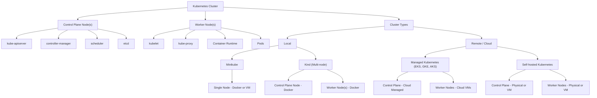

# Kubernetes Cluster Structure (Mermaid Diagram)

## Resource Management:
- CPU and Memory (RAM): Kubernetes manages CPU and memory allocation through resource requests and limits. You can specify how much CPU and memory each container needs, and Kubernetes schedules pods accordingly and enforces these limits.
- Storage: Kubernetes manages persistent volumes, storage classes, and volume claims. It can provision, attach, and manage disk storage across different storage backends.
- GPUs: Kubernetes can manage GPU resources through device plugins. It can schedule workloads that require GPUs and ensure proper GPU allocation to containers.

## Network Management:
- Pod networking and IP address assignment
- Service discovery and load balancing
- Network policies for traffic control
- Ingress controllers for external access

## Cluster Operations:
- Node management and health monitoring
- Workload scheduling across nodes
- Auto-scaling of applications and infrastructure
- Rolling updates and rollbacks
Health checks and self-healing capabilities

## Security and Access Control:
- Role-based access control (RBAC)
- Pod security policies
- Secrets and configuration management
- Network security policies

## Additional Orchestration:
- Job scheduling and cron jobs
- StatefulSets for stateful applications
- DaemonSets for node-level services
- ConfigMaps for application configuration

## 📌 In Local Development (like Minikube):
- The entire cluster is usually one node (a Docker container or VM).
- That one node plays both roles:
    - 🧠 Control plane (scheduler, API server, etc.)
    - 💪 Worker node (runs your app containers)
- This is for simplicity and speed—great for testing and learning.

## 📌 In Advanced / Multi-node Clusters:

- A cluster might have:
    🔹 1+ control plane nodes
    🔹 Many worker nodes

- Each node might be:
    🔹 A Docker container (for local, simulated setups)
    🔹 A VM (in cloud or virtualized on-prem)
    🔹 A physical machine (in bare-metal clusters)
---




## 🧠 Key Points From the Tree:
- A Kubernetes cluster is made up of nodes (control + worker).

- Minikube simulates all of this in one container or VM.

- Kind uses multiple Docker containers to simulate nodes.

- In the cloud, nodes are usually virtual machines.


---

```pgspl
Kubernetes Cluster
├── Control Plane Node(s)
│   ├── kube-apiserver
│   ├── controller-manager
│   ├── scheduler
│   └── etcd (cluster state database)
├── Worker Node(s)
│   ├── kubelet (manages pods on this node)
│   ├── kube-proxy (networking)
│   ├── Container Runtime (e.g., Docker, containerd)
│   └── Pods (your app containers)
│
├── Cluster Types
│   ├── Local
│   │   ├── Minikube (single-node)
│   │   │   └── One Docker container or VM as full cluster
│   │   └── Kind (multi-node simulation)
│   │       ├── Control Plane Node → Docker container
│   │       └── Worker Nodes → Docker containers
│   │
│   └── Remote / Cloud
│       ├── Managed Kubernetes (EKS, GKE, AKS)
│       │   ├── Control Plane → Managed by cloud provider
│       │   └── Worker Nodes → Cloud VMs (e.g., EC2, GCE)
│       └── Self-hosted Kubernetes
│           ├── Control Plane → Physical or virtual machine
│           └── Worker Nodes → Physical or virtual machines
```

## 📦 Node Components

| Component | Role |
|-----------|------|
| kubelet | Talks to Kubernetes API, runs containers |
| container runtime | Runs containers (e.g., Docker, containerd) |
| kube-proxy | Handles networking for pods |
| Pods | Your actual app workloads |

## 📦 What’s Included in a Minikube Cluster?
- kube-apiserver – main API entrypoint for Kubernetes
- kubelet, kube-proxy, controller-manager – standard Kubernetes components
- etcd – local key-value database for cluster state
- kubectl access – you can use kubectl to interact with your cluster just like on a cloud cluster

# Kubernetes Cheatsheet

## 🏗️ Cluster Architecture

### 📌 Local Development (Minikube/Kind)
- **Minikube**: Single-node cluster (Docker/VM) with both control plane and worker components
- **Kind**: Multi-node simulation using Docker containers
- **K3d**: Lightweight Kubernetes distribution by Rancher (runs in Docker)

### ☁️ Production/Cloud Clusters
- **Control Plane Nodes**: 3-5 nodes (for high availability)
- **Worker Nodes**: Scale as needed
- **Node Types**:
  - **Spot/Preemptible**: Cost-effective, can be terminated
  - **On-demand**: Stable but more expensive
  - **GPU/TPU**: Specialized workloads

## 🧩 Core Components

### Control Plane
- **kube-apiserver**: Cluster's frontend to the API
- **etcd**: Consistent and highly-available key-value store
- **kube-scheduler**: Assigns pods to nodes
- **kube-controller-manager**: Runs controller processes
- **cloud-controller-manager**: Links to cloud provider's API

### Worker Nodes
- **kubelet**: Ensures containers are running in a pod
- **kube-proxy**: Maintains network rules
- **Container Runtime**: Docker, containerd, or CRI-O
- **Pods**: Smallest deployable units

## 🛠️ Essential Commands

### Cluster Management
```bash
# Get cluster info
kubectl cluster-info

# Get nodes
kubectl get nodes -o wide

# Get component status
kubectl get componentstatuses
```

### Pod Operations
```bash
# List pods in all namespaces
kubectl get pods --all-namespaces

# Describe a pod
kubectl describe pod <pod-name> -n <namespace>

# Get pod logs
kubectl logs <pod-name> -n <namespace>

# Stream logs
kubectl logs -f <pod-name> -n <namespace>

# Execute command in pod
kubectl exec -it <pod-name> -n <namespace> -- /bin/sh
```

### Deployment & Scaling
```bash
# Create deployment
kubectl create deployment <name> --image=<image>

# Scale deployment
kubectl scale deployment <deployment> --replicas=3

# Autoscale deployment
kubectl autoscale deployment <deployment> --min=2 --max=5 --cpu-percent=80
```

### Services & Networking
```bash
# Expose deployment
kubectl expose deployment <name> --type=LoadBalancer --port=80

# Get services
kubectl get svc

# Port-forward to pod
kubectl port-forward <pod-name> 8080:80
```

### Configuration & Secrets
```bash
# Create secret
kubectl create secret generic <name> --from-literal=key=value

# Create configmap from file
kubectl create configmap <name> --from-file=config.properties

# View secrets/configmaps
kubectl get secrets
kubectl get configmaps
```

## 📊 Kubernetes Objects

| Object | Purpose | Example Command |
|--------|---------|-----------------|
| Pod | Smallest deployable unit | `kubectl run nginx --image=nginx` |
| Deployment | Manages ReplicaSets | `kubectl create deployment nginx --image=nginx` |
| Service | Exposes pods as network service | `kubectl expose deployment nginx --port=80` |
| ConfigMap | Non-confidential config data | `kubectl create configmap` |
| Secret | Store sensitive data | `kubectl create secret` |
| Namespace | Virtual cluster | `kubectl create namespace dev` |
| Ingress | Manages external access | `kubectl create ingress` |
| PersistentVolume | Storage resource | `kubectl get pv` |
| StatefulSet | Workload with persistent storage | `kubectl get statefulset` |
| DaemonSet | Ensures pod runs on all nodes | `kubectl get daemonset` |

## 🔄 Common Workflows

### Deploying an Application
1. Create deployment: `kubectl create deployment nginx --image=nginx`
2. Expose service: `kubectl expose deployment nginx --port=80 --type=LoadBalancer`
3. Access: `kubectl get services` (use EXTERNAL-IP)

### Debugging
```bash
# Describe resource
kubectl describe <resource>/<name>

# Get events
kubectl get events --sort-by='.metadata.creationTimestamp'

# Check pod status
kubectl get pods -o wide

# View pod logs
kubectl logs <pod-name> -n <namespace>
```

## 🚀 Advanced Topics

### Helm
```bash
# Add repo
helm repo add stable https://charts.helm.sh/stable

# Install chart
helm install my-release stable/nginx-ingress

# List releases
helm list
```

### Kustomize
```yaml
# kustomization.yaml
resources:
  - deployment.yaml
  - service.yaml
configMapGenerator:
- name: app-config
  files:
    - config.properties
```

### Monitoring & Logging
- **Metrics Server**: Cluster-wide metrics
- **Prometheus**: Monitoring
- **Grafana**: Visualization
- **ELK/Fluentd**: Logging

## 🔗 Useful Resources
- [Kubernetes Documentation](https://kubernetes.io/docs/)
- [Kubernetes Cheat Sheet](https://kubernetes.io/docs/reference/kubectl/cheatsheet/)
- [Kubernetes The Hard Way](https://github.com/kelseyhightower/kubernetes-the-hard-way)
- [Kubernetes Patterns](https://kubernetes.io/docs/concepts/configuration/overview/)

## 📦 Minikube Specific
```bash
# Start cluster
minikube start --driver=docker

# Enable addons
minikube addons enable ingress
minikube addons enable metrics-server

# Access dashboard
minikube dashboard

# Get service URL
minikube service <service-name> --url
```

## 🛡️ Security Best Practices
- Use RBAC for access control
- Enable network policies
- Use pod security policies
- Rotate credentials regularly
- Enable audit logging
- Use namespaces for isolation
- Set resource limits and requests